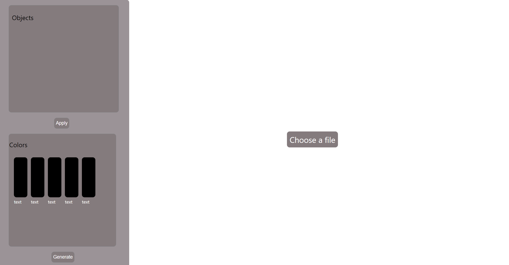
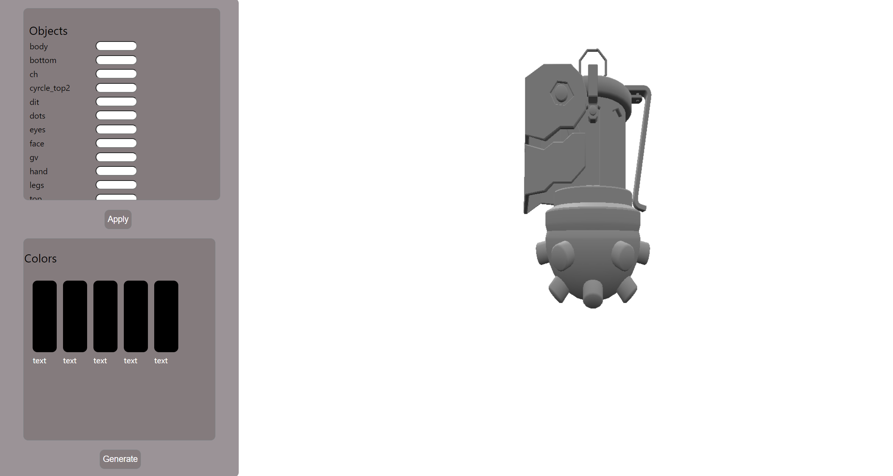

# ColorIT

Link: https://thandriss-app-efec2d3b9c51.herokuapp.com/
Steps for usage:

Press on "Choose the file" and upload file in .obj format. Model should be manifold. 

On the left part of screen you will see the list of objects and input field, where you can input color value in hex format. After the click the "Apply" button, colors will be applied on the model.
Moreover, after pressing the "Generate" button, 5 matching colors will appear on screen with their hex code. 

**!TIP: You can rotate the model with button up, down, left and right. Files for checking you can get from the files folder in my repository** 

**!TIP:In networks in my github you can see a lot of commits directly in main branch, it is because I had some problems with deployment**
